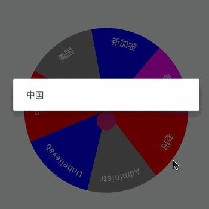

```
repositories {
    ...
    mavenCentral()
}

implementation 'io.github.aa86799:Android-Turntable:1.0.3'

 <com.stone.turntable.lib.TurntableView
    android:id="@+id/turntable"
    android:layout_width="300dp"
    android:layout_height="wrap_content"
    app:turntable_pointer="@mipmap/pointer"
    app:turntable_pointer_angle="270"
    app:turntable_text_size="16sp"
    app:layout_constraintBottom_toBottomOf="parent"
    app:layout_constraintLeft_toLeftOf="parent"
    app:layout_constraintRight_toRightOf="parent"
    app:layout_constraintTop_toTopOf="parent" />

```

```kotlin
val view = findViewById<TurntableView>(R.id.turntable)
val textList = listOf("中国", "美国", "新加坡", "泰国", "老挝", "Administrator", "Unbelievable")
view
    .setColors(listOf(Color.RED, Color.GRAY, Color.BLUE, Color.MAGENTA))
//            .setTimeInterpolator(LinearInterpolator())
//            .setTimeInterpolator(DecelerateInterpolator())
    .setAnimEndDuration(3000L)
    .setTouchToEndDelay(2000L)
    .setTextList(textList)
view.mOnRotateEndListener = {
    AlertDialog.Builder(this).setMessage(textList[it]).create().show()
}
view.mOnPartClickListener = {
    AlertDialog.Builder(this).setMessage(textList[it]).create().show()
}
view.post {
    view.drawingTurntable()
}
```